# Business Analytics Tools


The popularity of business analytics tools have reached a boiling point in recent years. This change is driven by the need to increase the depths of functionality these tools deliver without a data scientist supporting them. Businesses are developing advanced technologies to meet this new need. These advances have resulted in a new age of cutting-edge business analytics tools described in this repo.

## Google Tag Manager
The [Google Tag Manager](https://marketingplatform.google.com/about/tag-manager/) container snippet is a small piece of JavaScript and non-JavaScript code that you paste into your pages. It enables Tag Manager to fire tags by inserting gtm.js into the page (or through the use of an iframe when JavaScript isn't available). Use [GTM](https://marketingplatform.google.com/about/tag-manager/) to manage tags (such as tracking and marketing optimization JavaScript tags) on your site. Without editing your site code, you use GTM user interface to add and update Google Ads, Google Analytics, Floodlight, and non-Google tags. This reduces errors and allows you to deploy tags on your site quickly.

### Installation
Copy the following JavaScript and paste it as close to the opening <head> tag as possible on every page of your website, replacing GTM-XXXX with your container ID:

```js
<!-- Google Tag Manager -->
<script>(function(w,d,s,l,i){w[l]=w[l]||[];w[l].push({'gtm.start':
new Date().getTime(),event:'gtm.js'});var f=d.getElementsByTagName(s)[0],
j=d.createElement(s),dl=l!='dataLayer'?'&l='+l:'';j.async=true;j.src=
'https://www.googletagmanager.com/gtm.js?id='+i+dl;f.parentNode.insertBefore(j,f);
})(window,document,'script','dataLayer','GTM-XXXX');</script>
<!-- End Google Tag Manager -->
```
Copy the following snippet and paste it immediately after the opening <body> tag on every page of your website, replacing GTM-XXXX with your container ID:
```js
<!-- Google Tag Manager (noscript) -->
<noscript><iframe src="https://www.googletagmanager.com/ns.html?id=GTM-XXXX"
height="0" width="0" style="display:none;visibility:hidden"></iframe></noscript>
<!-- End Google Tag Manager (noscript) -->
```

### Adding tags via Google Tag Manager
- Click on "New Tag" button, name it GA

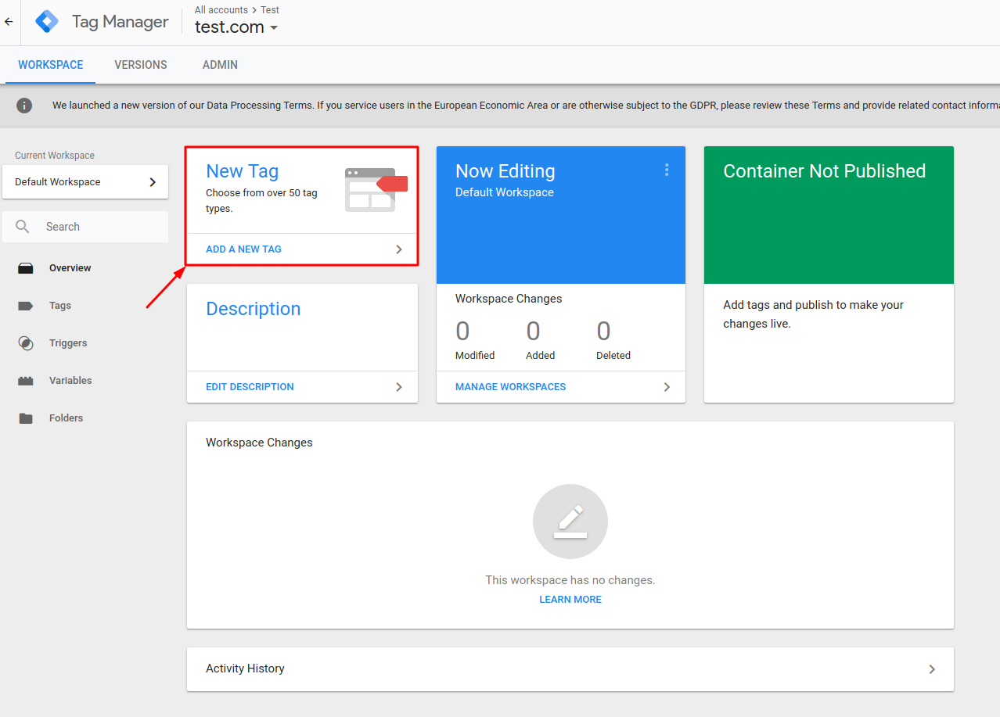

- Click on "Tag Configuration" area

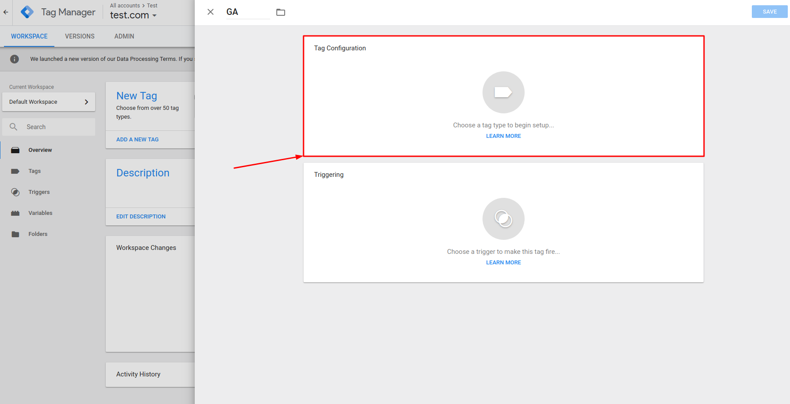

- GTM has already defined tags for most popular tools, so let`s choose GA tag. Note that you can define your custom tags.

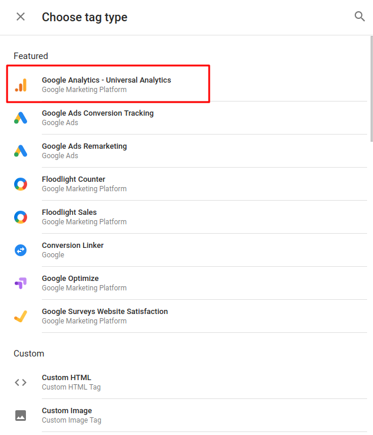

- Next step is to configure tag variables

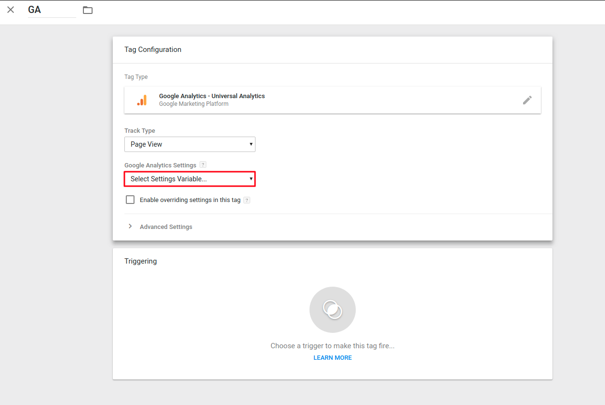

- Let's define GA ID

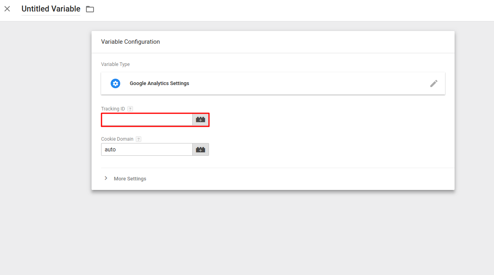

## Google Analytics
[Google Analytics](https://marketingplatform.google.com/about/analytics/) makes it easy to understand how your site and app users are engaging with your content, so you know what’s working and what’s not. See how people are interacting with your sites and apps and the role that different channels play by viewing robust reports and dashboards. You can even connect systems used to measure CRM, points of sale, and other touchpoints with your customers for a more complete view.

- GA builds a general overview graph of the website usage. It allows to behold the volume of active users, sessions executed, and session duration within a certain time frame. Also, Bounce Rate helps you to understand what website pages are less visited to improve the content if needed. 


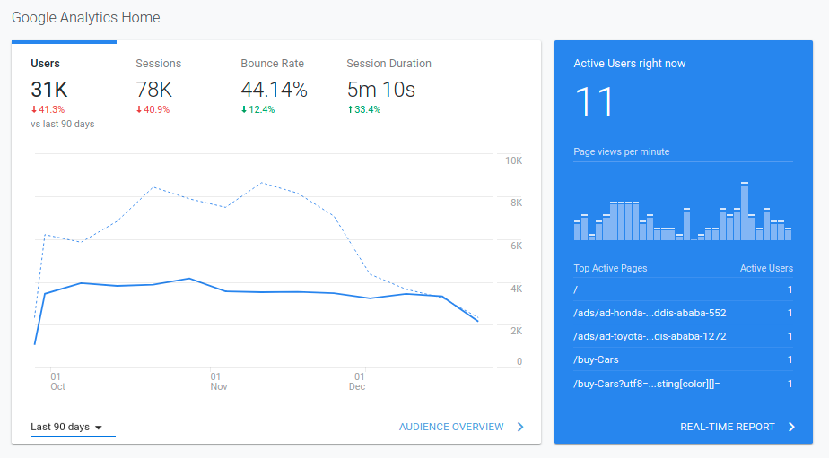

- Active users. This section allows to monitor a Monthly/Weekly/Daily website usage within a certain time frame. The trends helps to emphasize the seasonal prevalence of active users’ engagement. 

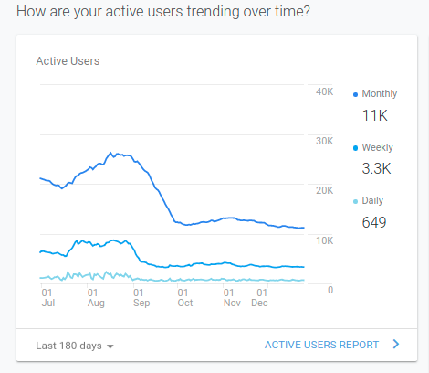

- Active regions and time of day. Monitor the active regions and day of time the users are mostly active. 

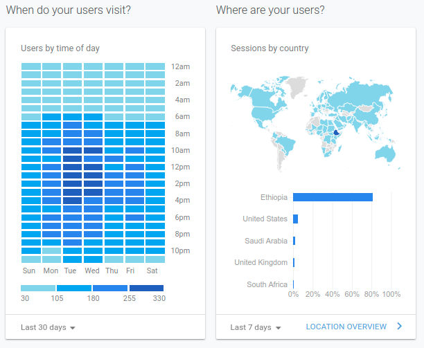

- Device sessions. Monitor the most predominant devices used to reach out the website. It allows tracking the device traffic to improve the following site version. 

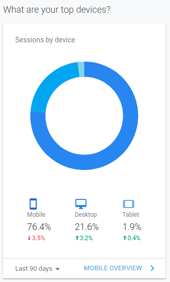

### Conclusion

Google Analytics is a great platform for carrying out basic analysis of the website data. If you know how to use it properly, it can give you a lot of useful information on how to improve your website, offers and catch up with your competition. Don't just stare at pretty graphs, learn how to use them to gain advantage and more conversions.

## Facebook pixel
When someone visits your website and takes an action (for example, buying something), the [Facebook pixel](https://www.facebook.com/business/learn/facebook-ads-pixel) is triggered and reports this action. This way, you know when a customer takes an action after seeing your Facebook ad. You are also able to reach this customer again by using a Custom Audience. When more and more conversions happen on your website, Facebook gets better at delivering your ads to users who are more likely to take certain actions. This is called conversion optimization.

- Devices. Monitor the most predominant devices used to engage with an advertisement. It allows tracking the device engagement within a certain time frame.  

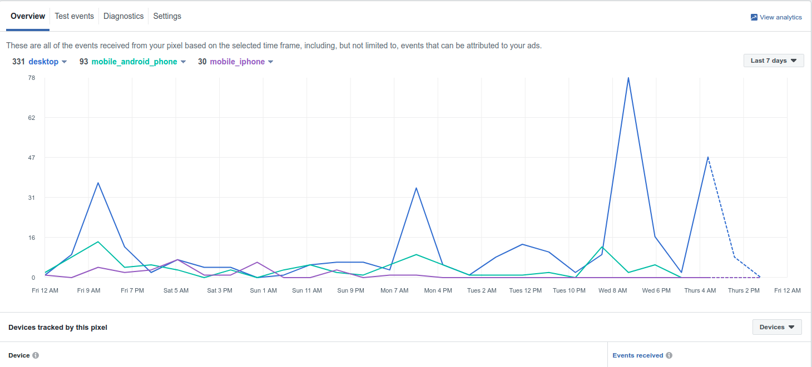

- Page Views. Monitor the views of a site within a certain time frame.

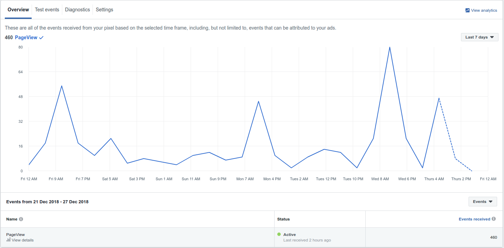

[Add FB Pixel via GTM](https://www.facebook.com/business/help/1021909254506499)

## Hotjar
Hotjar allows you to visualize how users engage with your site. Hotjar uses interactive heatmaps of their clicks and actions, recordings of their sessions, and gathering of their words from survey and feedback polls to help build a strong, data-backed understanding of what exactly users are using the site for, and how they’re using it.

- User interaction with the website. Understand what users want, care about, and do on the site by visually representing their clicks, taps, and scrolling behavior.

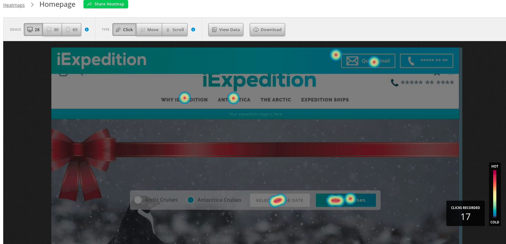

- User interaction by device type. Track the user interaction within a certain device type. 

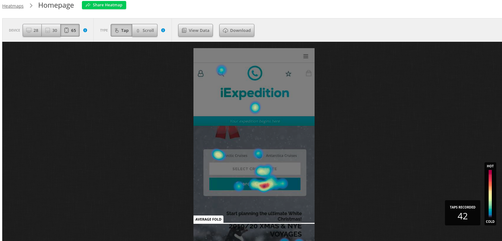

[Add Hotjar via GTM](https://help.hotjar.com/hc/en-us/articles/115009499708-Google-Tag-Manager)

### Conclusion

Hotjar is a trending, powerful tool that reveals the online behavior of the users. By combining both Analysis and Feedback tools, Hotjar gives the ‘big picture’ of how to improve the site's user experience and performance/conversion rates.


## License
business-analytics-tools is Copyright © 2015-2018 Codica. It is released under the [MIT License](https://opensource.org/licenses/MIT).

## About Codica

[](https://www.codica.com)

We love open source software! See [our other projects](https://github.com/codica2) or [hire us](https://www.codica.com/) to design, develop, and grow your product.
